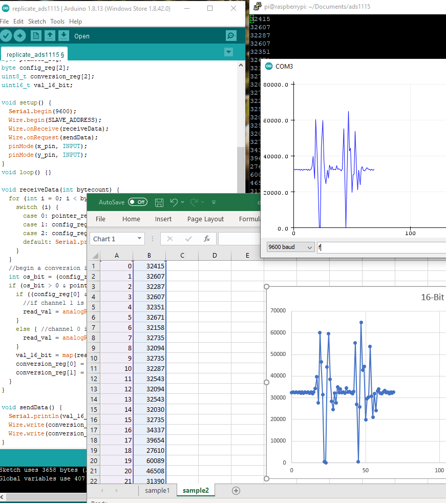

# ADS1115_for_RaspberryPi
I rewrote my [ptap_ads1115 library](https://github.com/BenClark1/ptap_ads1115) in C for a Raspberry Pi Zero. Two pressure transducers will be used, so this code reads from two different channels on one ADC. This was written for [Cal Poly Space Systems](https://github.com/CalPolySpaceSystems). To test the code, I also programmed an Arduino to behave like an ADS1115 would. I used the Arduino to read analog signals from a 3-axis accelerometer and convert them to 16-bit values. The read_ads1115.c file is then able to read this data through I2C, and write it to a file on the raspberry pi's SD card.   

This image shows data generated on the Arduino side and an excel graph of the data stored on the raspberry pi. The matching graphs show that the data is being read correctly:

I am always trying to learn from my mistakes, so [provide feedback or suggestions for improvement](https://github.com/BenClark1/ADS1115_for_RaspberryPi/issues). Your input is appreciated.

### Author
Ben Clark

### Acknowledgements
I referenced Lewis Loflin's [youtube video](https://www.youtube.com/watch?v=OPC5lXCKp_w&feature=youtu.be).
